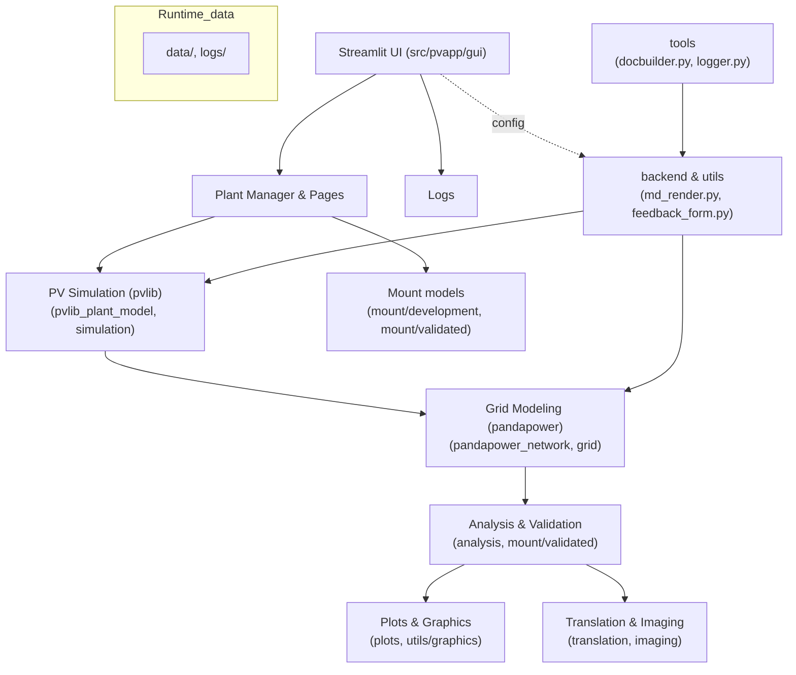

# Programmer Philosophy

## Source Code Structure (`src/`)

The project is organized into modules reflecting its main functionalities:

```

│
├── pvapp/
│   ├── main.py
│   ├── analysis/
│   ├── backend/
│   ├── gui/
│   └── tools/
```

- **pvapp/**: Main module.
  - **main.py**: Entry point.
  - **analysis/**: Data analysis and database management.
  - **backend/**: Simulation logic, physical models, plant management.
  - **gui/**: User graphical interface.
  - **tools/**: Utilities and logging.

---

## Main Backend Libraries

### Pandapower
- **Purpose**: Simulation of electrical networks, power flow analysis, validation of PV plant grid connection.
- **Pros**: Detailed modeling, support for complex grids, integration with pandas.
- **Key functions used**:
  - Network creation (`create_empty_network`, `create_bus`, `create_line`, ...)
  - Power flow calculation (`runpp`)
  - Fault analysis and grid parameter validation
- **Usage in project**: In `backend/pandapower_network/` to simulate the grid and validate PV plant connections.

### PVLib
- **Purpose**: Simulation of photovoltaic production, module and environmental modeling.
- **Pros**: Wide library of physical and empirical models, support for various technologies and locations.
- **Key functions used**:
  - Module modeling (`pvsystem`, `modelchain`)
  - Production calculation (`get_aoi`, `get_irradiance`, `get_power`)
  - Environmental simulation (`location`, `temperature`, ...)
- **Usage in project**: In `backend/pvlib_plant_model/` to simulate PV production and analyze plant performance.

### Numpy & Pandas
- **Purpose**: Efficient management of numerical data and tables.
- **Pros**: Speed, flexibility, advanced data analysis and manipulation functions.
- **Key functions used**:
  - Array and DataFrame manipulation
  - Statistical operations and aggregations
- **Usage in project**: Used across backend and analysis for simulation data and input/output management.

### Matplotlib & Plotly
- **Purpose**: Graphical visualization of results.
- **Pros**: Static (Matplotlib) and interactive (Plotly) charts, integration with Streamlit.
- **Key functions used**:
  - Generation of production, performance, and grid flow charts
- **Usage in project**: In `utils/graphics/` and for reporting.

---

## Main GUI Libraries

### Streamlit
- **Purpose**: Creation of interactive web interfaces for dashboards and analysis tools.
- **Pros**: Fast development, dynamic layouts, interactive widgets, seamless Python integration.
- **Key functions used**:
  - `st.sidebar`, `st.selectbox`, `st.button`, `st.dataframe`, `st.plotly_chart`, `st.markdown`
  - Application state management (`st.session_state`)
  - Visualization of results and reports
- **Usage in project**: In `gui/maingui.py` and `gui/pages/` for data presentation and user interaction.

### Altair & Plotly
- **Purpose**: Interactive data visualization in the GUI.
- **Pros**: Modern, interactive charts, easily integrated in Streamlit.
- **Key functions used**:
  - Creation of custom charts for the dashboard
- **Usage in project**: For presenting results to the user.

### gettext & json
- **Purpose**: Localization and translation management for the interface.
- **Pros**: Multilingual support, dynamic text translation.
- **Key functions used**:
  - Translation of interface texts
- **Usage in project**: In `gui/i18n/` and `gui/utils/translation/`.

---

## Development Philosophy

- **Modularity**: Clear separation between simulation logic, data management, and presentation.
- **Scalability**: Each module can be extended or replaced without impacting the rest of the system.
- **Maintainability**: Clear structure, use of standard and well-documented libraries.
- **Interactivity**: Users can intuitively explore data and results thanks to Streamlit and interactive charts.

---

This architecture and the choice of libraries allow the project to effectively address the typical challenges of energy analysis and PV plant simulation, while providing a modern and accessible user experience.
