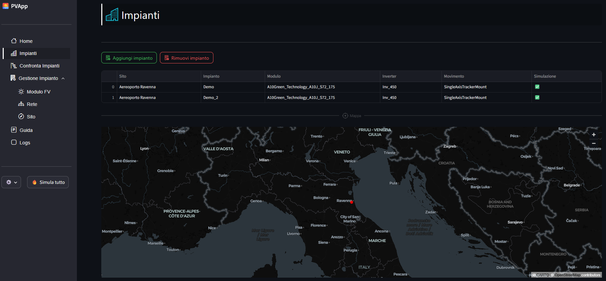

# 🏗️ How To build a Plant
> Since this guide is in english, but the PVApp has also the option to select italian, the commands name in the latter language will be inside "[...]"

1. Go to *Plants* [*Impianti*] page  
