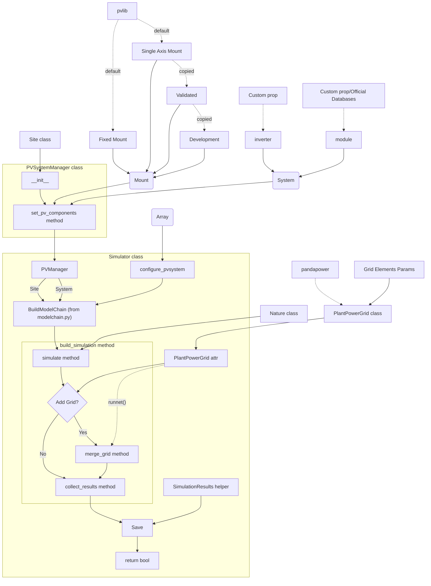

# 🧑‍💻 Developer Philosophy

## Source Code Structure (`src/pvapp`)
More than 10 thousand code (you can count them with ```make count_lines``` in the command line) lines that make up this project are realized with specific aims:
- **Modularity**: Clear separation between simulation logic, data management, and presentation.
- **Scalability**: Each module can be extended or replaced without impacting the rest of the system.
- **Maintainability**: Clear structure, use of standard and well-documented libraries.
- **Interactivity**: Users can intuitively explore data and results thanks to Streamlit and interactive charts.

Hence, the software is organized into four parts, reflecting its main functionalities:
1.  `/backend`
2.  `/analysis`
3.  (GUI) `/gui`
4.  `/tools`
>


### 1. System and Simulation `/backend`
#### Folder structure
```bash
/backend
├── /pvlib_plant_model    # pvlib manager classes
│   ├── modelchain.py       # create the model chain used by pvlib to simulate performances
│   ├── plant.py            # manage inverter, module properties mount type and site to pass it in the pvlib modelchain simulation
│   └── site.py             # manage the location of the plant to add in the pvlib simulation
├── /mount                # Mount classes
│   ├── /developement       # not yet certificated
│   │   ├── costummount.py  # custom class for mounting to add into pvlib simulations
│   │   └── tacking.py      # algorithm used in CustomMount class to track the sun and give moudle positions
│   └── /validated        # certificated system
│       ├── costummount.py 
│       └── tacking.py
├── /pandapower_network   # pandapwer manager clss
│   ├── pvnetwork.py
│   └── TypedDict_elements_params.py # pandapower grid elements dicts
└── /Simulation           # classes and fucntions for simulations
    ├── nature.py           # Nature class where eneviromental conditions used for simulation are created
    └── simulator.py        # Simulator class
```
####  Simulation logic Flow among classes and functions



#### Description
In order to facilitate maintainability and the potential extension with new options and features, the functions and operations have been modularized into classes, frequently reflecting the structure already implemented in [`pvlib`](#pvlib) or [`pandapower`](#pandapower). This may appear non-functional or excessive in some cases, but it is kept in mind that `pvlib` package is not complete and customizations may be necessary over time.  
A *Plant* is made up by four parts and for a :  
- The ***Site***: managed by `class Site` (`/backend/pvlib_plant_model/site.py`) basically realized on the `class Location` from `pvlib`
- The ***System***: composed by module and inverter parameters, saved in `/data/.../plant.json` (like the format below)
```json
{
    "module": {
        "origin": "CECMod",
        "name": "A10Green_Technology_A10J_S72_175",
        "model": {},
        "dc_model": "cec"
    },
    "inverter": {
        "origin": "Custom",
        "name": "Inv_450",
        "model": {
            "pdc0": 450.0
        },
        "ac_model": "pvwatts"
    },
    "mount": {
        "type": "SingleAxisTrackerMount",
        "params": {}
    },
    "name": "Demo_2"
}
```
- The ***Mount*** system: this can be of two type currently, namely `FixedMount` `SingleAxisMount`, both defined in `pvlib.pvsystem` and realised on the base of the abstract `class AbstractMount`. From the latter, two more "custom" mount has been created to give the possibility to define custom *Mounts*. Both are `class CustomMount(AbstractMount)`, but saved in two different folders:  
  - `/backend/mount/validated`: where a fully functional and verified *Mount* is aviable;
  - `/backend/mount/developement`: for a provisional and still under testing *Mount*.  
  > In these folder there are two files, one for the real `CostumMount` (`../costummount.py`) and the other for tracking computations functions (`../tracking.py`)  
- The ***Grid***: Thanks to pandapower, the plant’s electrical network can be simulated. This is handled by the `class PlantPowerGrid` (`/backend/pandapower_network/pvnetwork.py`), which redefines the standard `pandapower logic`. Instead of applying functions to a standalone network object, the network itself is encapsulated within a class instance, turning it into an object with its own methods. This design was adopted to improve manageability, ensure finer control over errors and exceptions, and follow a more consistent object-oriented logic.  
>
Finally, the `class PVSystenManager` allow to set and control first three part, that are mandatory for every simulation. Instead the last one can be just an additional option, so it is sepaterated from the other, considering also that it depends on a completely different package.  
>
Simulation are orchestrated by `class Simulator` (`/backend/simulation/simulator.py`). It takes data from json (or .csv in some case) files with plant parameters thanks to dedicated loading methods. With the `class Nature` (`/backend/simulation/nature.py`) the enviromental condition for the simulations are created and loaded in a dedicated `pandas.DataFrame`.  After attribute setting of `Simulator`, `build_simulation()` method can be called and using dedicated functions and method, data are created and saved in `/data/../simulation.csv` file.
>  
For more details about the classes and packages, check the dedicated documentations


### 2. Results and Analysis `/analysis`
### 3. Graphical User Interface `/gui`
#### Folder structure
```bash
gui/
├── i18n/
├── pages/
│   ├── guide/
│   │   └── guide.py
│   ├── home/
│   │   └── home.py
│   ├── logs/
│   │   └── logs.py
│   ├── plant_manager/
│   │   ├── grid/
│   │   │   └── grid.py
│   │   ├── module/
│   │   │   └── module.py
│   │   ├── site/
│   │   │   └── site.py
│   │   └── plant_manager.py
│   ├── plants/
│   │   ├── add_plant/
│   │   │   └── add_plant.py
│   │   ├── districts.json
│   │   └── plants.py
│   ├── plants_comparison/
│   │   └── plants_comparison.py
│   ├── __init__.py
│   └── page.py
├── utils/
│   ├── graphic/
│   │   ├── feedback_form.py
│   │   └── md_render.py
│   ├── plots/
│   │   ├── __init__.py
│   │   └── plots.py
│   └── translation/
│       ├── __init__.py
│       └── translator.py
└── gui.py
``` 
#### Description
The GUI is handle by the `streamlit` function defined in `/gui/gui.py`. In the same file many function are defined to create the correct sidebar, routing the page to show, manage the language and some other utility features for simulation.
The final GUI is made up of seven pages:  
1. ***Home***: here generic informations and suggestion about the PVApp are showed. It is the README.md file of the project.  
2. ***Plants***: in this page the user can check, add and (in future) remove the *Plants* existing in `/data` folders. Exept for a map realized with `pydeck` package and a `pandas.Dataframe`, no other features are relevant from a coding point of view.  
3. ***Compare Plant***: this page has been developed to compare the performance of *Plant* belonging or not to the same *Site* via `class PlantAnalyser` to get *Plants* data (from folders in `/data`) and plots from `/utils/plot` to show them. The plot logic is the same of "Analysis" section in the next page for Module and Grid.  
4. ***Plant Management***: The core of PVApp to manage a *Plant* project. Due to its size and complexity in terms of coding and functionalities, the description deserve a dedicate documentation in `docs/Graphic User Interface Guide/plant_manager.md`.  
5. ***Guide***: actually, this isn't only a page, but a new different section in the PVApp. When the page is selected in the sidebar menu, `/docs` folder is showed in the sidebar and documents are visible in the Streamlit page. This is possible via `class MarkdownStreamlitPage` (created entirely thanks to ChatGPT), that takes `markdown` files and it correctly renders them in the Streamlit App.
> Note: translations .json format are saved in `/gui/i18n` in a structure readable by the traslator function means dot to follow a precise branch and reach the right word/list of word in the file.
6. ***Logs***: this is a very useful page both for users and developers, which has been taken from an old project by the devoloper and repurposed for this project. It takes the log file (`/logs/pvapp.log`) and show the message in a `pandas.DataFrame` with the possibility to filter the logs with time, severity and file that sent them.
>
All these pages are inherited from `class Page` defined in `gui/pages/page.py`, since `traslate` method (actually fully defined in `utils/translation`) is common:
```python
import streamlit as st
from ..utils.translation.traslator import translate
from tools.logger import get_logger

class Page:
    def __init__(self, pagename) -> None:
        self.lang = st.session_state.get("language", "it")
        self.page_name = pagename
        self.logger = get_logger("pvapp")

    def T(self, key: str) -> str | list:
        return translate(f"{self.page_name}.{key}")

```

### 4. Tools `/tools`
Utilities and central logger are manage in this folder. But nothing relevant for the project is or will be added here
>
---
# Important package : and what has driven their choice  
> 

## Main Backend Libraries

### - Pandapower
- **Purpose**: Simulation of electrical networks, power flow analysis, validation of PV plant grid connection.
- **Pros**: Detailed modeling, support for complex grids, integration with pandas.
- **Key functions used**:
  - Network creation (`create_empty_network`, `create_bus`, `create_line`, ...)
  - Power flow calculation (`runpp`)
  - Fault analysis and grid parameter validation
- **Usage in project**: In `backend/pandapower_network/` to simulate the grid and validate PV plant connections.

### - PVLib
- **Purpose**: Simulation of photovoltaic production, module and environmental modeling.
- **Pros**: Wide library of physical and empirical models, support for various technologies and locations.
- **Key functions used**:
  - Module modeling (`pvsystem`, `modelchain`)
  - Production calculation (`get_aoi`, `get_irradiance`, `get_power`)
  - Environmental simulation (`location`, `temperature`, ...)
- **Usage in project**: In `backend/pvlib_plant_model/` to simulate PV production and analyze plant performance.

### - Numpy & Pandas
- **Purpose**: Efficient management of numerical data and tables.
- **Pros**: Speed, flexibility, advanced data analysis and manipulation functions.
- **Key functions used**:
  - Array and DataFrame manipulation
  - Statistical operations and aggregations
- **Usage in project**: Used across backend and analysis for simulation data and input/output management.

### - Matplotlib & Plotly
- **Purpose**: Graphical visualization of results.
- **Pros**: Static (Matplotlib) and interactive (Plotly) charts, integration with Streamlit.
- **Key functions used**:
  - Generation of production, performance, and grid flow charts
- **Usage in project**: In `utils/graphics/` and for reporting.

---

## Main GUI Libraries

### - Streamlit
- **Purpose**: Creation of interactive web interfaces for dashboards and analysis tools.
- **Pros**: Fast development, dynamic layouts, interactive widgets, seamless Python integration.
- **Key functions used**:
  - `st.sidebar`, `st.selectbox`, `st.button`, `st.dataframe`, `st.plotly_chart`, `st.markdown`
  - Application state management (`st.session_state`)
  - Visualization of results and reports
- **Usage in project**: In `gui/maingui.py` and `gui/pages/` for data presentation and user interaction.

### - Altair & Plotly
- **Purpose**: Interactive data visualization in the GUI.
- **Pros**: Modern, interactive charts, easily integrated in Streamlit.
- **Key functions used**:
  - Creation of custom charts for the dashboard
- **Usage in project**: For presenting results to the user.

---

